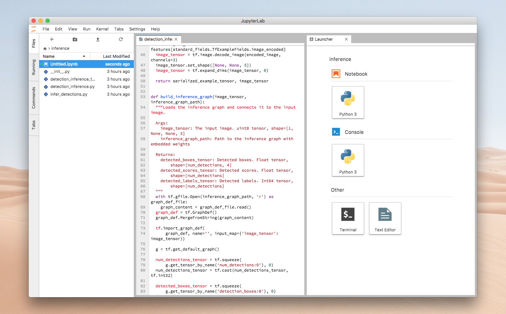

# jupyter-lab-native
Run Jupyter Lab natively on Mac!



## Installation

### 1. Install dependencies

```bash
npm install nativefier
brew install toilet
```

### 2. Create a Jupyter electron app

Note that **naming matters here**, since we later use AppleScript to open the application.

```bash
nativefier --name "Jupyter Lab" "http://localhost:8888/"
nativefier --name "Jupyter Notebook" "http://localhost:8888/"
```

This will create native applications called "Jupyter Lab" and "Jupyter Notebook" in your `/Applications` folder.

### 3. Add this repo's script to your .bash_profile or .zshrc

```bash
git clone https://github.com/stevenschmatz/jupyter-native
cd jupyter-native

# OPTIONAL: Use this if you use a .bash_profile (default)
if [ -f ~/.bash_profile ]; then cat jupyter-native.sh >> ~/.bash_profile; fi

# OPTIONAL: Use this if you use a .zshrc
if [ -f ~/.zshrc ]; then cat jupyter-native.sh >> ~/.zshrc; fi
```

### 4. Run `lab` or `notebook` in your terminal!

